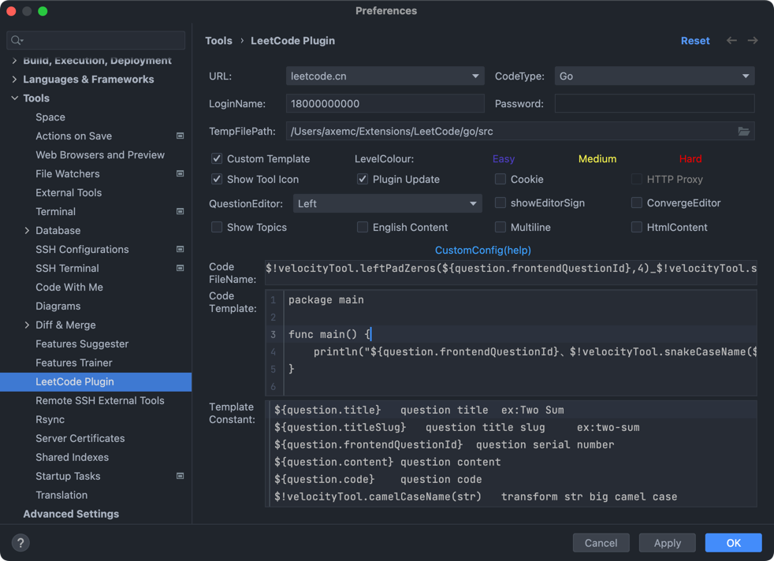

## Introduction

### Plugin Settings


### Topic Commands
```shell
$!velocityTool.leftPadZeros(${question.frontendQuestionId},4)_$!velocityTool.snakeCaseName(${question.titleSlug})
```

### Content Commands
```shell
package main

func main() {
	println("${question.frontendQuestionId}、$!velocityTool.snakeCaseName(${question.titleSlug})")
}

${question.code}
```
