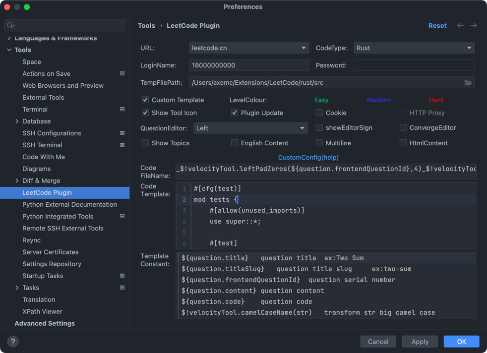

## Introduction

### Plugin Settings


### Topic Commands
```shell
_$!velocityTool.leftPadZeros(${question.frontendQuestionId},4)_$!velocityTool.snakeCaseName(${question.titleSlug})
```

### Content Commands
```shell
#[cfg(test)]
mod tests {
    #[allow(unused_imports)]
    use super::*;

    #[test]
    fn test() {
        println!("${question.frontendQuestionId}、$!velocityTool.snakeCaseName(${question.titleSlug})");
    }
}

#[allow(dead_code)]
struct Solution;

${question.code}
```
